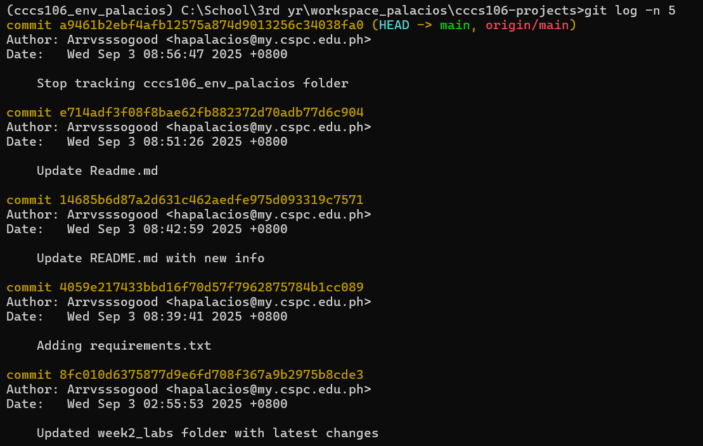

# Lab 2 Report: Git Version Control and Flet GUI Development

**Student Name:** Harvey Lloyd Palacios\
**Student ID:** 231002286\
**Section:** A
**Date:** September 3, 2025
## Git Configuration

### Repository Setup
- **GitHub Repository:** [\[Your repository URL\]](https://github.com/Arrvsssogood/cccs106-projects.git)
- **Local Repository:** ✅ Initialized and connected
- **Commit History:** There are currently 11 commits in my repository, but I should only have 4 commits (from the latest initial commit to add the updated labreport2). This is happening because every time I try to delete the repository and recreate it, the commits remain. I believe this issue is related to the local repository, which is why the commits are still there

### Git Skills Demonstrated
- ✅ Repository initialization and configuration
- ✅ Adding, committing, and pushing changes
- ✅ Branch creation and merging
- ✅ Remote repository management

## Flet GUI Applications

### 1. hello_flet.py
- **Status:** ✅ Completed
- **Features:** Interactive greeting, student info display, dialog boxes
- **UI Components:** Text, TextField, Buttons, Dialog, Containers
- **Notes:** I noticed that the 'App Info' button wasn’t working. However, I found a solution by adjusting the page.overlay.append(dialog) in the show info section. Other than that, I didn’t encounter any major challenges. I did make a couple of changes, though—specifically, I updated the 'Please input name' text to red, as I think it suits the design better than green. I also made the screen size larger

### 2. personal_info_gui.py
- **Status:** ✅ Completed
- **Features:** Form inputs, dropdowns, radio buttons, profile generation
- **UI Components:** TextField, Dropdown, RadioGroup, Containers, Scrolling
- **Error Handling:** Input validation and user feedback
- **Notes:** Similarly, in the hello_flet.py file, I adjusted some code to make the error messages for earnings appear. Other than that, I didn’t encounter any challenges.

## Technical Skills Developed

### Git Version Control
- Understanding of repository concepts
- Basic Git workflow (add, commit, push)
- Branch management and merging
- Remote repository collaboration

### Flet GUI Development
- Flet 0.28.3 syntax and components
- Page configuration and layout management
- Event handling and user interaction
- Modern UI design principles

## Challenges and Solutions

As mentioned, the main challenges were the error messages not appearing and the app info button not working. I addressed these issues by adjusting the code to make both the error messages and the app info button function correctly. Additionally, I added error handling to both programs to improve the user experience and make the app run more smoothly.

## Learning Outcomes
I learned a lot about Flet and how easy it is to implement and adjust. It was surprising how quickly I could make changes to the user interface and see them reflected in the app. I also got a better understanding of version control, especially how changes in the terminal sync with your GitHub repository. It made me realize how useful version control is for keeping track of progress and making sure everything is organized.

One of the biggest takeaways is how version control makes collaborating with others much easier. With GitHub, I can work with teammates, track changes, and merge code without worrying about conflicts. It really highlighted how important these tools are for smooth and efficient teamwork.

## Screenshots
Successful pushes:\

Hello Flet:

Personal Information UI:\

### Git Repository
- [ ] GitHub repository with commit history
- [ ] Local git log showing commits

### GUI Applications
- [ ] hello_flet.py running with all features
- [ ] personal_info_gui.py with filled form and generated profile

## Future Enhancements
It would be great to add more fields like phone number, email, and address to make the profile more complete. Maybe including social media links or emergency contacts could also be helpful. That way, users can create a fuller picture of themselves in the app. These little changes would make the program more useful and personal for everyday life. Also, improving hte ui and the users experience to make it more engaing and attractive to use.